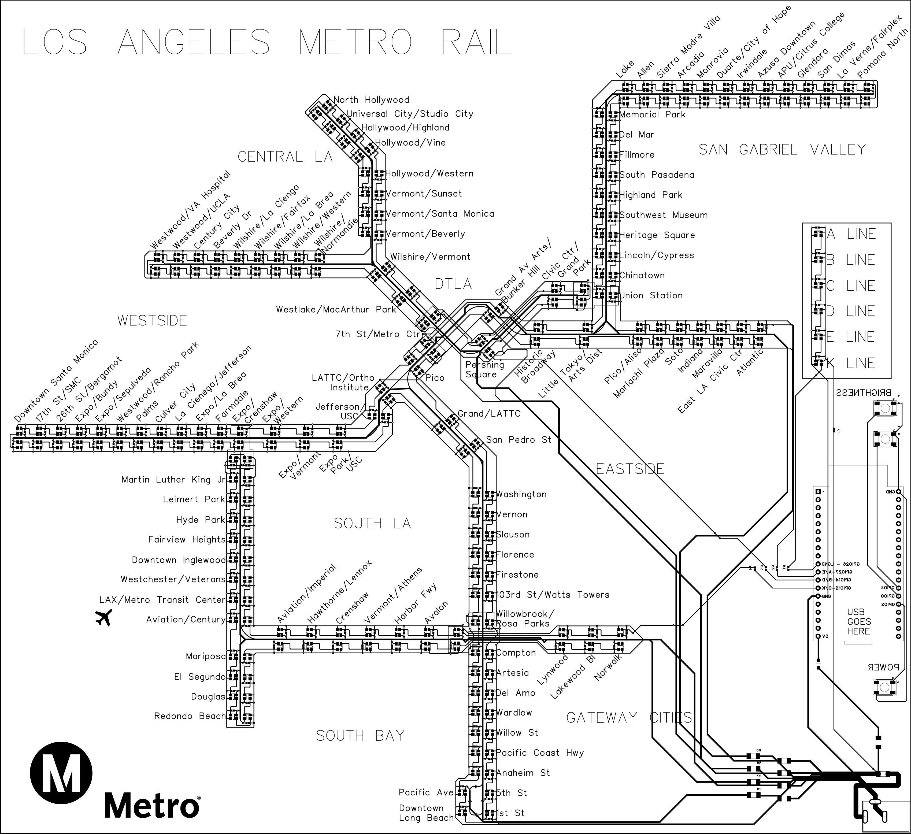

# LA Metro Live

## Description
A live version of the Los Angeles GoMetro map, printed directly on a PCB and using WS2812Cs (2020 package).

https://github.com/user-attachments/assets/ebdb1551-d2c1-4a6d-937b-43f40449b2b8

## PCB Design
The PCB is designed with several major features:
- The main power input, and individual inputs to each set of LEDs have fuses that will blow at about 20% below the maximum current rating of the traces
- A Schottky diode is placed before the 5V input for the ESP32 to prevent accidentally powering the LEDs directly from the ESP32, which would occur when the USB cable for the ESP is plugged in, but the power cable is not
- All LEDs have capacitors between power and ground to help ensure power stability
- Each line can be completely isolated using jumpers (0Ω resistors)

The board uses WS2812C-2020 pixels, which are individually addressable work very similar to LED strip lighting. There are four chains of LEDs, each connected in a large loop. They are grouped by sets of tracks rather than individual lines. For example, the A and E lines share tracks, so they are both part of one chain. The mappings for stations to nodes can be found in `mappings/*`.

### BOM
| No. | Quantity | Comment | Footprint | Manufacturer Part |
| --- | -------- | ---------------------- | ------------------------------------ | ------------------- |
| 1 | 3 | Pushbutton | PTS647SK38SMTR2LFS_CNK | PTS647SK38SMTR2LFS |
| 2 | 238 | 100nF cap | C0201 | GRM033C71C104KE14D |
| 3 | 1 | Schottky diode | SC-76, SOD-323 | B5819WS-TP |
| 4 | 1 | 0Ω Resister | R1206 | C1F 3 |
| 5 | 4 | 0Ω Resistor | R1206 | C1F 1 |
| 6 | 238 | WS2812C-2020 | LED-SMD_4P-L2.0-W2.0-TL_WS2812B-2020 | WS2812B-2020 |
| 7 | 4 | 0Ω Resistor | R0402 | RC0402JR-070RL |
| 8 | 4 | 0Ω | R1206 | RMCF1206ZT0R00 |
| 9 | 1 | Power Barrel Connector | KLDX-0202-B_KYC | 2092-KLDX-0202-B-ND |
| 10 | 1 | ESP32-DEVKITC-32E | MODULE_ESP32-DEVKITC-32E | ESP32-DEVKITC-32E |
| 11 | 1 | 5V 3A power connector | - | WSU050-3000-13 |

## Assembly
The PCB was assembled completely using a variety of tools and techniques.

1. The capacitors are 0.6mmx0.3mm, making them impossible to solder by hand. To install them, a dollop of solder paste on each pad, then tweezers were used to place them and align them properly. A heat gun was then used to melt the paste, fixing any issues with tweezers. 
2. The smaller fuses, jumpers, and diodes were installed with the same technique.
3. The ESP32 and power jack were installed using standard soldering techniques
4. The pixels proved to be the hardest to install. They are too small to be soldered by hand, but are also very sensitive to heat, making a heat gun impossible. The technique that proved effective was placing soldering paste on each pad and aligning the LEDs on them with tweezers. Then, a soldering iron with a special SMD tip was used to melt the paste on each individual pad, while tweezers were used to hold it in place.
5. The entire board was then scrubbed clean using 99% Isopropyl alcohol, a ESD-safe wire brush, and a microfiber cloth. This cleaned out all residual flux on the board, which will absorb moisture and become slightly conductive.

## Software
The software is programmed in C with the ESP-IDF (the Espressif IoT Development Framework). The WIFI module is used to connect to an access point, after which an HTTPS link is established to make calls to the API.

The API used to obtain live train data is the Swiftly GTFS-rt-vehicle-positions endpoint. This provides data in the Google Protocol Buffer format, which is then decoded using protobuf-c.

The code for HTTPs calls and WiFi access are based on examples provided by Espressif.
